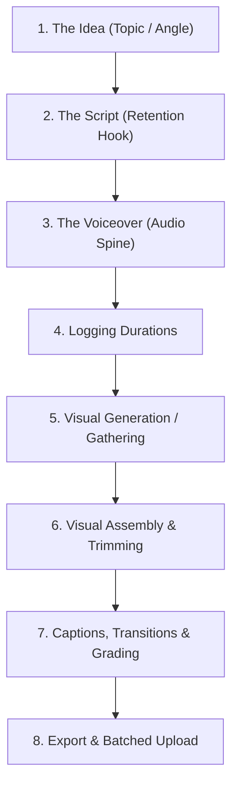

# Diagram Alir Jalur Produksi

Gunakan diagram alur dan lembar pemetaan ini untuk mengaudit langkah-langkah produksi pabrik Anda. Pertahankan aliran linier setiap video searah untuk menghindari penanganan ganda aset.

---

## 1. Diagram Saluran Pipa Linier

---

## 2. Audit Stasiun Saluran Pipa

| Stasiun | Pemilik / Alat | Masukan yang Dibutuhkan | Pembayaran / Keluaran | Waktu Sasaran |
|---|---|---|---|:---:|
| **1. Ide** | LLM / Reddit / Tren | Kata kunci khusus | Pengait judul & 3 sudut skrip | 5 menit |
| **2. Skrip** | Claude 3.5 / Template Skrip | Topik yang dinilai | Teks skrip 150 kata | 10 menit |
| **3. Suara** | SebelasLabs / TTS API | Teks skrip | Trek suara `.wav`/`.mp3` yang diedit | 5 menit |
| **4. Pencatatan** | Lembar Log Narasi | Berkas audio | Perangko potong milidetik | 3 menit |
| **5. Visual** | muapi / Stok / Kanvas | Deskripsi visual | 5-10 klip latar belakang | 15 menit |
| **6. Perakitan** | CapCut / Tayang Perdana | File Audio + Visual | Garis waktu yang dipotong secara kasar | 10 menit |
| **7. Polandia** | Keterangan Teks + LUT | Potongan kasar | Master yang dipoles dan diberi teks | 10 menit |
| **8. Antrian** | Pengunggah Web Platform | File induk + deskripsi SEO | Dijadwalkan, menunggu rilis | 5 menit |

**Total Waktu Kumulatif per Video:** **63 menit** (Target: Di bawah 60 menit untuk operator berpengalaman).
